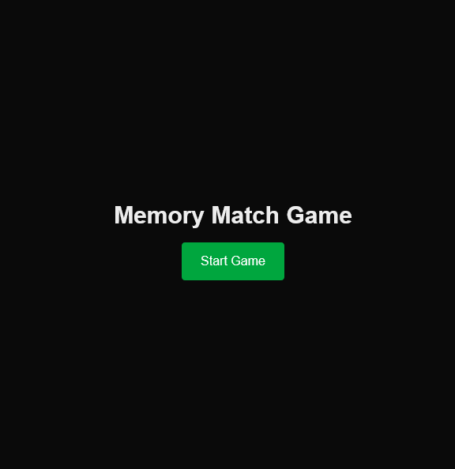
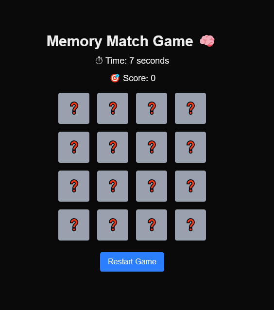
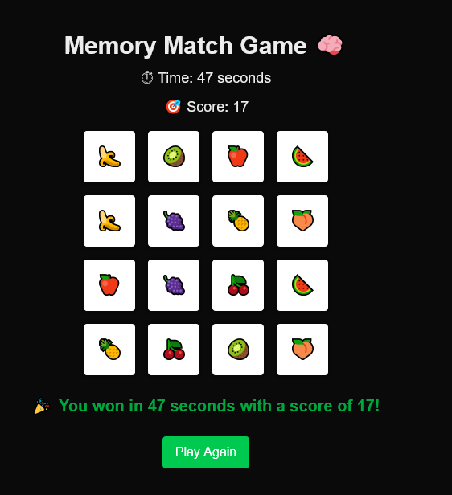

<a href='https://memory-match-weld.vercel.app/' target='_blank'></a>
# 🧠 Memory Match Game

A fun and simple memory matching game built using **Next.js (App Router)** and **TypeScript**. Flip the cards, match the emojis, and beat the clock!

## 🚀 Features

- Emoji-based card matching
- Score tracking
- Timer
- Win detection
- Restart button

## 📸 Demo

<!--    -->





*Flip the cards and try to match them all as fast as possible!*

## 🧩 How to Play

1. Click on a card to flip it.
2. Flip two cards at a time to find a matching pair.
3. If they match, they stay flipped.
4. If not, they flip back after 1 second.
5. The game ends when all cards are matched.
6. Try to finish as fast as possible with the least moves!

## 🛠️ Tech Stack

- [Next.js 14+ (App Router)](https://nextjs.org/docs/app)
- TypeScript
- Tailwind CSS
- React Hooks (`useState`, `useEffect`)

## 📦 Getting Started

### 1. Clone the Repository

```bash
git clone https://github.com/yourusername/memory-match.git
cd memory-match
```
### 2. Install Dependencies

```bash
npm install
```

### 3. Run the Development Server
```bash
npm run dev
```

This is a [Next.js](https://nextjs.org) project bootstrapped with [`create-next-app`](https://nextjs.org/docs/app/api-reference/cli/create-next-app).

## Getting Started

First, run the development server:

```bash
npm run dev
# or
yarn dev
# or
pnpm dev
# or
bun dev
```

Open [http://localhost:3000](http://localhost:3000) with your browser to see the result.

You can start editing the page by modifying `app/page.tsx`. The page auto-updates as you edit the file.

This project uses [`next/font`](https://nextjs.org/docs/app/building-your-application/optimizing/fonts) to automatically optimize and load [Geist](https://vercel.com/font), a new font family for Vercel.

### 📄 License
This project is open-source and free to use under the MIT License.

